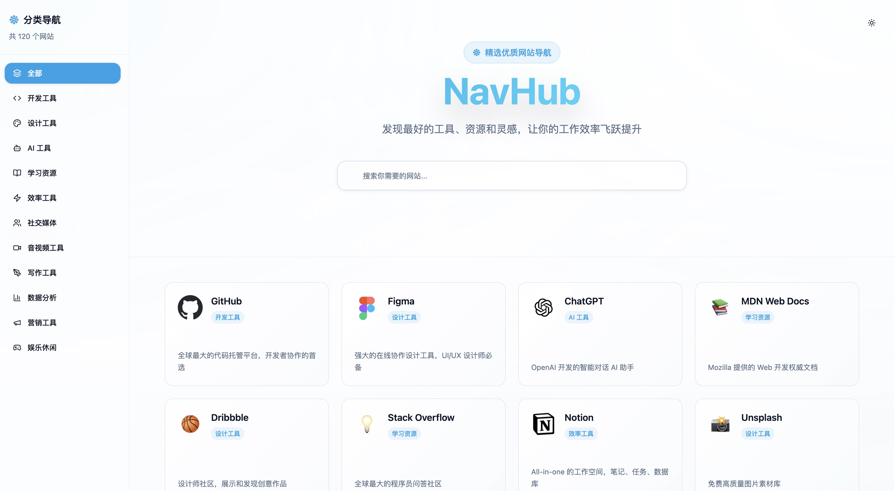

# NavHub - 精选网站导航

<div align="center">



*NavHub 精选网站导航 - 现代化界面设计*


[](https://reactjs.org/)
[](https://www.typescriptlang.org/)
[](https://vitejs.dev/)
[](https://tailwindcss.com/)

**发现最好的工具、资源和灵感，让你的工作效率飞跃提升**

[在线演示](https://navhub.pages.dev) • [功能特性](#功能特性) • [快速开始](#快速开始) • [自定义指南](#自定义指南)

</div>

## 📖 项目介绍

NavHub 是一个现代化的精选网站导航平台，收录了 100+ 个优质网站，涵盖开发工具、设计工具、AI 工具、学习资源等 12 大分类。通过精心设计的用户界面和强大的搜索功能，帮助用户快速发现和访问最优质的网络资源。

### ✨ 核心价值

- **精选优质** - 每个网站都经过精心筛选，确保质量和实用性
- **分类清晰** - 12 个专业分类，快速定位所需资源
- **搜索强大** - 支持标题和描述模糊搜索
- **体验优秀** - 现代化 UI 设计，响应式布局，流畅动画
- **SEO 优化** - 完善的 SEO 配置，提升搜索引擎可见性

## 🚀 功能特性

### 🎯 核心功能
- **📚 12 大分类** - 开发工具、设计工具、AI 工具、学习资源、效率工具等
- **🔍 智能搜索** - 支持网站标题和描述模糊搜索
- **📱 响应式设计** - 完美适配桌面端、平板和移动设备
- **🌙 主题切换** - 支持深色/浅色主题，自动跟随系统设置
- **♾️ 无限滚动** - 自动加载更多内容，提升浏览体验
- **🎨 精美动画** - 流畅的过渡动画和交互效果

### 🛠️ 技术特性
- **⚡ 极速加载** - Vite 构建，SWC 编译，毫秒级热更新
- **🔧 TypeScript** - 完整的类型安全，提升开发体验
- **🎨 现代 UI** - shadcn/ui + Radix UI 组件库
- **📱 移动优先** - 移动端优化的交互体验
- **🔍 SEO 友好** - 完善的 meta 标签和结构化数据
- **♿ 无障碍** - 遵循 WCAG 标准，支持键盘导航

## 🛠️ 技术栈

### 核心框架
- **[React 18.3.1](https://reactjs.org/)** - 用户界面库
- **[TypeScript 5.8.3](https://www.typescriptlang.org/)** - 类型安全的 JavaScript
- **[Vite 5.4.19](https://vitejs.dev/)** - 下一代前端构建工具

### UI 组件库
- **[shadcn/ui](https://ui.shadcn.com/)** - 现代化组件库
- **[Radix UI](https://www.radix-ui.com/)** - 无样式、可访问的组件原语
- **[Lucide React](https://lucide.dev/)** - 精美的图标库

### 样式方案
- **[Tailwind CSS 3.4.17](https://tailwindcss.com/)** - 实用优先的 CSS 框架
- **[Tailwind Animate](https://github.com/jamiebuilds/tailwindcss-animate)** - 动画插件
- **[next-themes](https://github.com/pacocoursey/next-themes)** - 主题切换

### 路由和状态
- **[React Router v6](https://reactrouter.com/)** - 声明式路由
- **[TanStack Query](https://tanstack.com/query)** - 数据获取和缓存

### 开发工具
- **[ESLint](https://eslint.org/)** - 代码质量检查
- **[PostCSS](https://postcss.org/)** - CSS 后处理器
- **[Autoprefixer](https://github.com/postcss/autoprefixer)** - CSS 前缀自动添加

## 🚀 快速开始

### 环境要求

- **Node.js** >= 18.0.0
- **npm** >= 8.0.0 或 **yarn** >= 1.22.0 或 **pnpm** >= 7.0.0

### 安装步骤

1. **克隆项目**
   ```bash
   git clone <YOUR_GIT_URL>
   cd react-directory
   ```

2. **安装依赖**
   ```bash
   npm install
   # 或
   yarn install
   # 或
   pnpm install
   ```

3. **启动开发服务器**
   ```bash
   npm run dev
   # 或
   yarn dev
   # 或
   pnpm dev
   ```

4. **打开浏览器**
   
   访问 [http://localhost:8080](http://localhost:8080) 查看应用

### 构建和预览

```bash
# 构建生产版本
npm run build

# 预览生产构建
npm run preview

# 开发模式构建
npm run build:dev
```

## 📁 项目结构

```
src/
├── components/           # 组件目录
│   ├── ui/              # shadcn/ui 基础组件
│   │   ├── button.tsx
│   │   ├── input.tsx
│   │   ├── card.tsx
│   │   └── ...
│   ├── SearchBar.tsx    # 搜索栏组件
│   ├── Sidebar.tsx      # 侧边栏组件
│   ├── SiteCard.tsx     # 网站卡片组件
│   ├── MobileCategorySheet.tsx  # 移动端分类选择
│   ├── Footer.tsx       # 页脚组件
│   ├── ThemeToggle.tsx  # 主题切换组件
│   └── SEO.tsx          # SEO 组件
├── data/                # 数据文件
│   └── sites.ts         # 网站数据和分类定义
├── pages/               # 页面组件
│   ├── CategoryPage.tsx # 分类页面
│   └── NotFound.tsx     # 404 页面
├── hooks/               # 自定义 Hooks
│   ├── use-mobile.tsx   # 移动端检测
│   └── use-toast.ts     # 消息提示
├── lib/                 # 工具函数
│   └── utils.ts         # 通用工具函数
├── assets/              # 静态资源
│   └── hero-bg.jpg      # 背景图片
├── App.tsx              # 应用根组件
├── main.tsx             # 应用入口
└── index.css            # 全局样式
```

## 🎨 自定义指南

### 添加新网站

在 `src/data/sites.ts` 文件中添加新的网站数据：

```typescript
export const sites: Site[] = [
  // ... 现有网站
  {
    id: 101,                    // 唯一 ID
    title: "新网站名称",         // 网站标题
    description: "网站描述",     // 网站描述
    url: "https://example.com", // 网站链接
    icon: "🔗",                 // 图标 emoji
    iconUrl: "https://example.com/favicon.ico", // 可选：自定义图标 URL
    category: "开发工具"         // 分类名称
  }
];
```

### 添加新分类

1. **在 `categoryList` 中添加新分类**：

```typescript
export const categoryList: Category[] = [
  // ... 现有分类
  { 
    name: "新分类", 
    slug: "new-category", 
    description: "新分类描述" 
  }
];
```

2. **确保分类名称与网站数据中的 `category` 字段一致**

### 修改主题配置

主题配置在 `src/components/ThemeProvider.tsx` 中：

```typescript
<ThemeProvider 
  attribute="class" 
  defaultTheme="dark"    // 默认主题
  enableSystem          // 跟随系统设置
>
```

### 自定义 UI 组件

项目使用 shadcn/ui 组件库，可以：

1. **添加新组件**：
   ```bash
   npx shadcn-ui@latest add [component-name]
   ```

2. **自定义现有组件**：
   编辑 `src/components/ui/` 目录下的组件文件

3. **修改全局样式**：
   编辑 `src/index.css` 文件

## 📊 数据结构说明

### Site 接口

```typescript
export interface Site {
  id: number;           // 唯一标识符
  title: string;        // 网站标题
  description: string;  // 网站描述
  url: string;         // 网站链接
  icon: string;        // 图标 emoji
  iconUrl?: string;    // 可选：自定义图标 URL
  category: string;    // 分类名称
}
```

### Category 接口

```typescript
export interface Category {
  name: string;        // 分类显示名称
  slug: string;        // URL 友好的标识符
  description: string; // 分类描述
}
```

### 工具函数

```typescript
// 根据 slug 获取分类名称
getCategoryBySlug(slug: string): string | undefined

// 根据分类名称获取 slug
getSlugByCategory(category: string): string | undefined

// 获取所有分类名称数组
categories: string[]
```

## 🚀 部署指南

### Cloudflare Pages 部署（推荐）

1. **安装 Wrangler CLI**：
   ```bash
   npm install -g wrangler
   ```

2. **登录 Cloudflare**：
   ```bash
   wrangler login
   ```

3. **构建项目**：
   ```bash
   npm run build
   ```

4. **部署到 Cloudflare Pages**：
   ```bash
   wrangler pages deploy dist --project-name=navhub
   ```

5. **配置自定义域名**（可选）：
   - 在 Cloudflare Dashboard 中进入 Pages 项目
   - 进入 Settings → Custom domains
   - 添加您的域名并配置 DNS

### Vercel 部署

1. **安装 Vercel CLI**：
   ```bash
   npm i -g vercel
   ```

2. **部署项目**：
   ```bash
   vercel
   ```

3. **配置环境变量**（如需要）

### Netlify 部署

1. **构建项目**：
   ```bash
   npm run build
   ```

2. **上传 `dist` 目录到 Netlify**

3. **配置重定向规则**（用于 SPA 路由）

### 自定义域名

1. **Cloudflare Pages**：
   - 在 Cloudflare Dashboard 中进入 Pages 项目
   - 进入 Settings → Custom domains
   - 添加您的域名并配置 DNS 记录
   - Cloudflare 会自动处理 SSL 证书

2. **其他平台**：
   - 在平台控制台添加自定义域名
   - 配置 DNS 记录指向平台服务器

## 🛠️ 开发相关

### 可用脚本

```bash
npm run dev          # 启动开发服务器
npm run build        # 构建生产版本
npm run build:dev    # 开发模式构建
npm run preview      # 预览生产构建
npm run lint         # 代码质量检查
```

### ESLint 配置

项目使用 ESLint 9.x 配置，包含：

- **@eslint/js** - 基础规则
- **typescript-eslint** - TypeScript 规则
- **eslint-plugin-react-hooks** - React Hooks 规则
- **eslint-plugin-react-refresh** - React 热更新规则

### 组件开发指南

1. **使用 TypeScript** - 为所有组件添加类型定义
2. **遵循命名规范** - 组件名使用 PascalCase
3. **使用 shadcn/ui** - 优先使用现有组件
4. **响应式设计** - 确保移动端兼容性
5. **无障碍支持** - 添加适当的 ARIA 属性

### 代码规范

- 使用 **Prettier** 格式化代码
- 遵循 **ESLint** 规则
- 组件文件使用 **PascalCase**
- 工具函数使用 **camelCase**
- 常量使用 **UPPER_SNAKE_CASE**

## 🤝 贡献指南

我们欢迎所有形式的贡献！

### 如何贡献

1. **Fork 项目**
2. **创建功能分支**：
   ```bash
   git checkout -b feature/amazing-feature
   ```
3. **提交更改**：
   ```bash
   git commit -m 'Add some amazing feature'
   ```
4. **推送分支**：
   ```bash
   git push origin feature/amazing-feature
   ```
5. **创建 Pull Request**

### 贡献类型

- 🐛 **Bug 修复** - 修复现有问题
- ✨ **新功能** - 添加新功能
- 📚 **文档** - 改进文档
- 🎨 **UI/UX** - 界面优化
- ⚡ **性能** - 性能优化
- 🔧 **工具** - 开发工具改进

## 📄 许可证

本项目采用 [MIT 许可证](LICENSE)。

## 🙏 致谢

感谢以下开源项目和服务：

- [React](https://reactjs.org/) - 用户界面库
- [Vite](https://vitejs.dev/) - 构建工具
- [shadcn/ui](https://ui.shadcn.com/) - 组件库
- [Tailwind CSS](https://tailwindcss.com/) - CSS 框架
- [Cloudflare Pages](https://pages.cloudflare.com/) - 部署平台

---

<div align="center">

**⭐ 如果这个项目对你有帮助，请给我们一个 Star！**

Made with ❤️ by NavHub Team

</div>